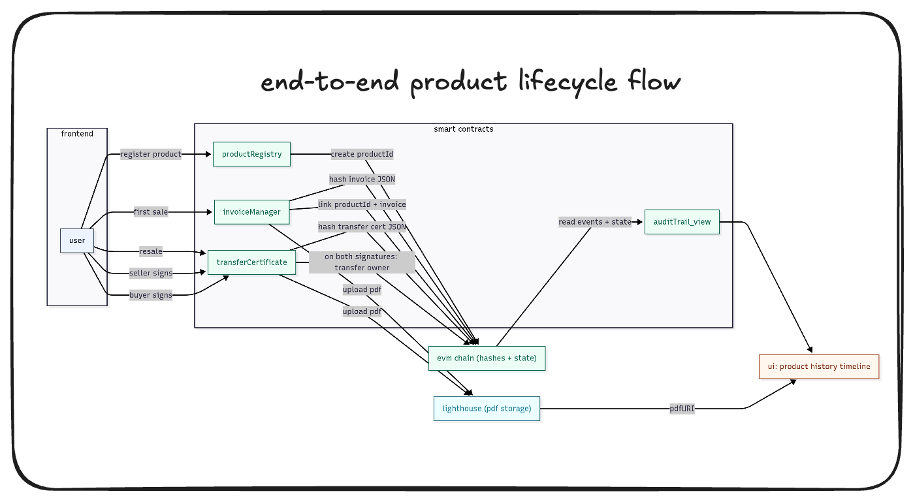
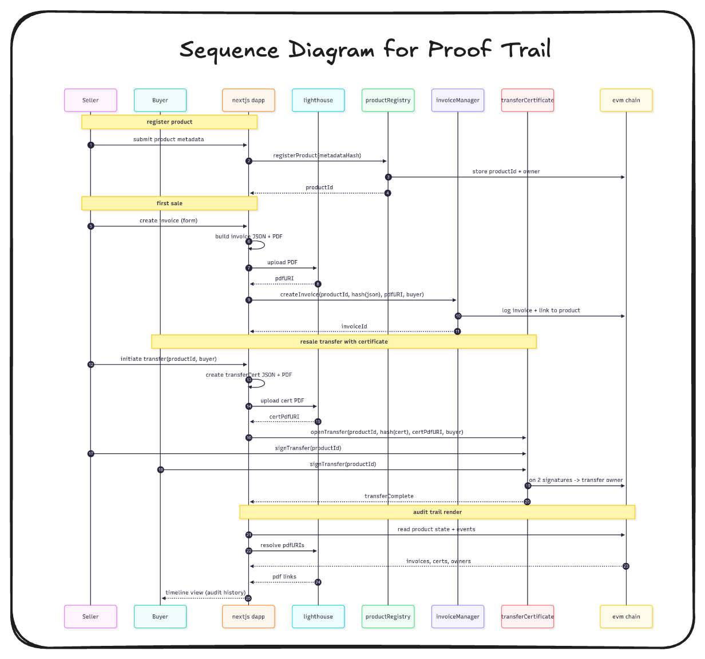

  

# ProofTrail

a decentralized application to track product ownership, invoices, and transfers onchain. built for ethglobal hackathon.

---

## why this project

today, product ownership and invoices live in silos. sellers issue pdfs, buyers store them, and auditors struggle to verify authenticity. once a product changes hands, the paper trail often breaks.  

prooftrail fixes this. every product starts onchain with no owner. the first sale registers it. every transfer after that creates a new invoice + transfer certificate. both buyer and seller sign onchain. all invoices live on lighthouse storage, and their hashed json versions sit immutably onchain. the result is a transparent audit trail anyone can verify.

---

## core features

- **product registration**  
  start with a unique product id. the first sale ties the product to a real owner.  

- **invoices**  
  every sale generates a pdf invoice stored on lighthouse. a json representation of the invoice is hashed and pinned to the chain.  

- **transfer certificate**  
  resale triggers a new invoice + transfer certificate. both buyer and seller must sign onchain before transfer completes.  

- **audit trail**  
  all invoices and certificates stay linked to the product id. no gaps. no forgery. anyone can view the history.  

---

## how it works

1. **register product** → product id created onchain.  
2. **first sale** → invoice pdf saved on lighthouse, json hash stored onchain. ownership tied to buyer.  
3. **resale** → new invoice + transfer certificate generated. both parties sign onchain.  
4. **audit trail** → chain keeps every record. ui displays full lifecycle of the product.  

---

## visual overview

### product lifecycle

### transaction sequence  

---

## tech stack

- **frontend**: next.js + tailwindcss + shadcn/ui for clean and fast ui.  
- **wallets**: rainbowkit + wagmi for easy evm wallet connect.  
- **storage**: lighthouse decentralized storage for pdfs.  
- **blockchain**: evm compatible chain (polygon, base, or any eth l2).  
- **contracts**: solidity smart contracts for product registry, invoices, and transfer certificates.  

---

## contracts overview

- **ProductRegistry.sol**  
  handles product registration and links audit trails.
  Deployed contract on Flow (EVM) : 0xBaD417A52CEe777A8E27C350f358828620142c3c 

- **InvoiceManager.sol**  
  creates invoices, stores lighthouse uri + json hash.  
  Deployed contract on Flow (EVM): 0xb1e7B18fFF13A480c7c31d8f715E8e2a5dB588E2

- **TransferCertificate.sol**  
  requires both buyer and seller signatures for ownership transfer.  

